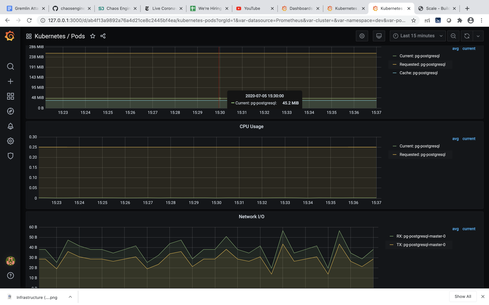
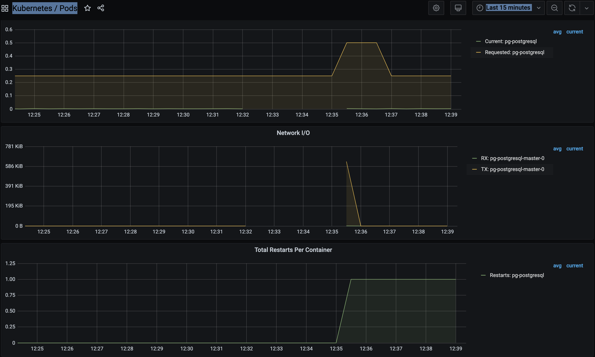

# iKube-Chaos
> chaos @ scale

## Table of Contents

  - [1.0 Introduction](README.md#introduction)
    - 1.1 Tech Stack
  - [2.0 Data Pipeline](README.md#data-pipeline)
    - 2.1 Overview - Scale
  - [3.0 DevOps Pipeline](README.md#devops-pipeline)
    - 3.1 Monitoring
    - 3.2 Chaos Testing
  - [4.0 Engineering Challenges](README.md#engineering-challenges)
    - 4.1 Deployment of Kubernetes cluster
  - [6.0 Development](README.md#development)
    - 6.1 Build and Deploy Data Pipeline

## 1.0 Introduction

Most often than not failures are bound to happen in the production environment.  On one hand, it is very difficult to predict and test every possible scenario in the test environment before deployment while on the other large-scale distributed systems make it even more complicated. Downtimes and outages costs companies on average $300K/hr in lost revenue.

My project focuses on taking a data pipeline, Scale, updating multiple instances of services in Aamazon EKS environment using Kubernetes Orchastration and then perform controlled chaos experiments in production environment to help identify unintended dependencies, bottlenecks and breakpoints.

### 1.1 Tech Stack

| Technology | Use Case |
| :---: | :---- |
| Terraform | automate infrastructure |
| AWS EKS | Kubernetess cluster deployment |
| Helm | Kubernetes configs in the form of charts |
| Prometheus / Grafana | monitoring setup through Kubernetes Operator |
| Gremlin | Injects Chaos in the environment

## 2.0 Data Pipeline

### 2.1 Overview - Scale

The existing batch data pipeline is called Scale. It is a music recommendation engine that finds similar songs based on shared instruments. The original application can be found [here](https://github.com/mothas/insight-music-project). The data pipeline is shown below:

 
  

  - S3: storage of midi files
  - Spark: extract data about instruments from midi files
  - Postgres: store results
  - Flask: view results

## 3.0 DevOps Pipeline

The existing DevOps pipeline is [here](https://github.com/ajgrande924/insight-project).The Flask, Postgres, and Spark components of the data pipeline have all been containerized. You can find the containers used for my deployment on [Docker Hub](https://cloud.docker.com/u/ajgrande924/repository/list) 

| Container | Description |
| :---: | :---- |
| `ajgrande924/scale-app` | scale flask application |
| `ajgrande924/spark-base` | custom spark base image |
| `ajgrande924/spark-master` | spark master built from spark base |
| `ajgrande924/spark-worker` | spark worker built from spark base |
| `ajgrande924/spark-client` | spark client built from spark base |

## 4.0 Deployment Architecture and Flow

 
  

## 5.0 Monitoring

Prometheus was installed in order to monitor Kubernetes Cluster using helm through terraform and Gremlin was installed in the cluster to create Chaos.

  - prometheus-operator
  - prometheus
  - alertmanager
  - node-exporter
  - kube-state-metrics
  - grafana
  - Gremlin

## 6.0 Chaos Testing

### Experiment #1: Host failures

The below pictures shows steady state behaviour of the app.

 
  

Steady State: All requests to API endpoint return tokens with no failures 

Hypothesis: If a single node of eks cluster hosting the postgres application fails, other instance of postgres should be able to handle the request. There will be no impact on the tokens generated. A new node should come up with the application deployed on it and join the load balancer. While the new instance is coming, we might see an increase in response time for the requests. 

#### Experiment 1.1 :  

Blast radius: Contained to a Single node.

Result:  The flask service was up while postgres db was down. I could see the webpage but there were no recommendations loaded back on page
         After furter analysis, I found, there was only one instance of postgres master in the cluster and it was on this node, hence postgres masteris a single point of failure which resides on attacked node. Targeting this node failed API hits from webapp to postgres in the cluster.  

Below postgres screenshot shows, network interruption during the attack and pod restarts after the attacks. 

 
  

#### Experiment 1.2 : 

Blast Radius: Attacked 2 nodes in the EKS cluster.

Result: Since postgres master db was not on this server, taking down this node had only latency delay for few seconds and loadbalancer effectively routed the traffic to worker service on other node. Prometheus monitoring was affected as Prometheus' main deamon was on this node and the node exporter didn't work without an input from this deamon. Concluding this experiment affected monitoring system on the cluster. After the attack new node was created and joined the load balancer.

 
  

As in the screenshot above memory usage data is not visible on prometheus as prometheus is down on the node and overall disk usage for other nodes increases as traffic is being routed. 

 
  

 
  

To perform successful autoscale on cluster :
`kubectl autoscale deployment py-pg --cpu-percent=50 --min=1 --max=10 `

### Experiment #2: CPU Usage Auto-Scaling

Steady State: Application behaves as expected while hosts come and go.

Hypothesis: When CPU usage ramps up and hits a set threshold, active instances will increase and decrease when CPU usage goes down. User sessions will remain active without throwing any errors.

Blast Radius: Attacked all 3 nodes eating CPU resources for 100% per node

Results : The web service was still running. All the 3 nodes were fully utilized till 100% of the capacity and all the instances was increased from 30 to 33 adding 3 postgres db and went back to 30 after the attack. Although I attacked all 3 nodes I could see delay in response time within a few seconds during the attack but there was zero downtime.

 
  

 
  

## 4.0 Engineering Challenges

### 4.1 Deployment of Kubernetes cluster
  
I initially tried to deploy EKS cluster on AWS using `eksctl` but using this command gave multiple security setup issues on AWS and there isnt not much instructions on how to solve it and what are required set of permissions to be able to deploy kubernetes cluster on AWs using `eksctl`. So I deployed EKS cluster using terraform it was easy to specify EC2 instances needed and could also be destroyed easily while in testing phase.

### 4.2 Designing Gremlin Attacks

## 6.0 Development

### 6.1 Build and Deploy Data Pipeline

To build and deploy the data pipeline, you will need the following dependencies:
 
`pip install -r requirements.txt`

Before deploying the data pipeline, these are the steps to build / containerize the application[here](https://github.com/ajgrande924/insight-project):

| Step | Command | Description |
| :---: | :---- | :---- |
| 1 | `./run_kube create_scale_app` | containerize flask app |
| 2 | `./run_kube create_spark_base` | create spark base image |
| 3 | `./run_kube create_from_spark_base` | create spark master and worker images from base |
| 4 | `./run_kube push_to_docker_hub` | push images to docker hub |
| 5 | `./run_kube gen_pg_assets` | generate hash_names.csv w/ md5_to_paths.json as intermediate |

To deploy the data pipeline to a Kubernetes cluster, you can run the following steps:

`cd terraform 
 terraform init
 terraform apply`

 To deploy Prometheus
 
`cd Prometheus-grafana
terraform init
terraform apply`

Create S3 bucket

`cd S3_bucket
 terraform init
 terraform apply`

Create Secret.yaml object in EKS Cluster

`kubectl create secret generic scale-secret \
  --from-literal=POSTGRES_DB='lmd' \
  --from-literal=POSTGRES_USER='postgres' \
  --from-literal=POSTGRES_PASSWORD='test' \
  --from-literal=AWS_ACCESS_KEY_ID='#######' \
  --from-literal=AWS_SECRET_ACCESS_KEY='######' \
  --from-literal=AWS_DEFAULT_REGION='us-east-2' -n dev`

Update Gremlin gremlin credentials in run_kube file and run

`./run_kube gremlin()`

Setup datapipeline 

`cd terraform/postgres
 terraform init
 terrafrom apply`

`./run_kube setup_scale_app`

Load Postgres w/ tables and data

`run_kube load_pg()`

submit spark job through spark client pod

`./run_kube submit_spark_job` 

Run Gemlin attacks using Gremlin Application[here](https://app.gremlin.com/)

